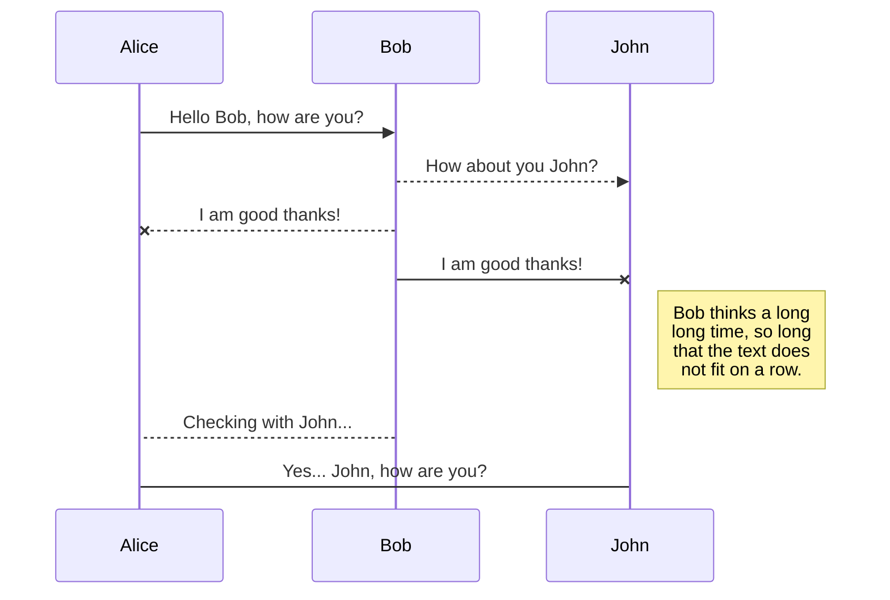
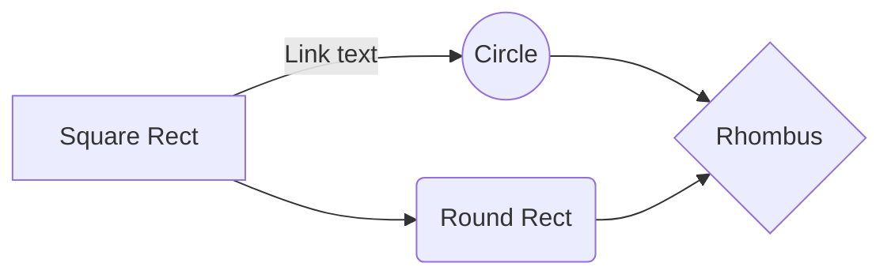

# 2018-9-11 15:10:58

## 写作目的

1.符合实际情况
2.

## 阅读对象

高管（要有抽象）

领导（要有可操作性）

部门员工（要符合实际）

## 目的

提高部门效益
激发团队活力
挖掘个人潜力
提升团队凝聚力

## 奖励

### 奖励对象

#### 团队奖励

领导奖励30%。

优秀员工占比（1-2名），奖励30%

普通成员，奖励40%。

#### 个人奖励

### 奖励条件

#### 创新

发现新的商业模式，调查分析基础，形成报告，对部门形成贡献的

优化工作流程，改进工作方法，从而提高工作效率，降低了成本（可衡量）

#### 增效

#### 增收
增加新客户
推销产品（软件）
签订项目合同（运维合同、新系统合同）
运维服务省钱
项目回款

#### 创新

#### 节支

#### 追回损失

### 奖励流程

确认其价值（由部门经理和财务、稽核部决定）→申请奖励→公司领导批准→财务部发放。

#### 奖励申请

凡是申请的奖励，要提交奖励申请报告和工作报告。

### 奖励形式

公司商品 （ETC设备和中欧商品）

加薪

奖状

书面表扬

礼品券

现金

提成

## 加分

工作任务提前多少天（提前天数/总天数）完成

超过工作计划完成量（自己报送工作计划，得到领导认可），超过10%，加几分；超过20%，加几分；超过30%，加几分。

形式知识条目。在工作后及时提交工作总结，纳入知识库，一条一分，每月最高3分。

提出可采纳的建议，每1条加1分，每月最高3分。

## 减分

##  薪酬

部门绩效考核评分获得A多少次以上。

获得公司奖励多少次。

对于完成重大任务，项目经理可以推荐优秀成员进行加薪。

年终，部门经理可以根据年度工作成绩（占60%，根据员工年度工作总结和日常表现）和部门评价结果（40%，每年的1月1日主管和员工进行互评和自评），对当年中的优秀主管和优秀员工提出加薪申请。

对公司做出突出贡献，获得合同多少数目以上，

挽救重大损失，减少了多少万元的损失。

### 预计计划
20180914形成初稿，发给领导及部门，征求意见。

### CHANGELOG
20180907，部门经理刘贝在部门例会上布置任务。
20180910，和同事沟通，薛栓勤发来参考文档。
20180911，和同事沟通，

Welcome to StackEdit!

Hi! I'm your first Markdown file in **StackEdit**. If you want to learn about StackEdit, you can read me. If you want to play with Markdown, you can edit me. Once you have finished with me, you can create new files by opening the **file explorer** on the left corner of the navigation bar.

# Files

StackEdit stores your files in your browser, which means all your files are automatically saved locally and are accessible **offline!**

## Create files and folders

The file explorer is accessible using the button in left corner of the navigation bar. You can create a new file by clicking the **New file** button in the file explorer. You can also create folders by clicking the **New folder** button.

## Switch to another file

All your files are listed in the file explorer. You can switch from one to another by clicking a file in the list.

## Rename a file

You can rename the current file by clicking the file name in the navigation bar or by clicking the **Rename** button in the file explorer.

## Delete a file

You can delete the current file by clicking the **Remove** button in the file explorer. The file will be moved into the **Trash** folder and automatically deleted after 7 days of inactivity.

## Export a file

You can export the current file by clicking **Export to disk** in the menu. You can choose to export the file as plain Markdown, as HTML using a Handlebars template or as a PDF.

# Synchronization

Synchronization is one of the biggest features of StackEdit. It enables you to synchronize any file in your workspace with other files stored in your **Google Drive**, your **Dropbox** and your **GitHub** accounts. This allows you to keep writing on other devices, collaborate with people you share the file with, integrate easily into your workflow... The synchronization mechanism takes place every minute in the background, downloading, merging, and uploading file modifications.

There are two types of synchronization and they can complement each other:

- The workspace synchronization will sync all your files, folders and settings automatically. This will allow you to fetch your workspace on any other device.
	> To start syncing your workspace, just sign in with Google in the menu.

- The file synchronization will keep one file of the workspace synced with one or multiple files in **Google Drive**, **Dropbox** or **GitHub**.
	> Before starting to sync files, you must link an account in the **Synchronize** sub-menu.

## Open a file

You can open a file from **Google Drive**, **Dropbox** or **GitHub** by opening the **Synchronize** sub-menu and clicking **Open from**. Once opened in the workspace, any modification in the file will be automatically synced.

## Save a file

You can save any file of the workspace to **Google Drive**, **Dropbox** or **GitHub** by opening the **Synchronize** sub-menu and clicking **Save on**. Even if a file in the workspace is already synced, you can save it to another location. StackEdit can sync one file with multiple locations and accounts.

## Synchronize a file

Once your file is linked to a synchronized location, StackEdit will periodically synchronize it by downloading/uploading any modification. A merge will be performed if necessary and conflicts will be resolved.

If you just have modified your file and you want to force syncing, click the **Synchronize now** button in the navigation bar.

> **Note:** The **Synchronize now** button is disabled if you have no file to synchronize.

## Manage file synchronization

Since one file can be synced with multiple locations, you can list and manage synchronized locations by clicking **File synchronization** in the **Synchronize** sub-menu. This allows you to list and remove synchronized locations that are linked to your file.

# Publication

Publishing in StackEdit makes it simple for you to publish online your files. Once you're happy with a file, you can publish it to different hosting platforms like **Blogger**, **Dropbox**, **Gist**, **GitHub**, **Google Drive**, **WordPress** and **Zendesk**. With [Handlebars templates](http://handlebarsjs.com/), you have full control over what you export.

> Before starting to publish, you must link an account in the **Publish** sub-menu.

## Publish a File

You can publish your file by opening the **Publish** sub-menu and by clicking **Publish to**. For some locations, you can choose between the following formats:

- Markdown: publish the Markdown text on a website that can interpret it (**GitHub** for instance),
- HTML: publish the file converted to HTML via a Handlebars template (on a blog for example).

## Update a publication

After publishing, StackEdit keeps your file linked to that publication which makes it easy for you to re-publish it. Once you have modified your file and you want to update your publication, click on the **Publish now** button in the navigation bar.

> **Note:** The **Publish now** button is disabled if your file has not been published yet.

## Manage file publication

Since one file can be published to multiple locations, you can list and manage publish locations by clicking **File publication** in the **Publish** sub-menu. This allows you to list and remove publication locations that are linked to your file.

# Markdown extensions

StackEdit extends the standard Markdown syntax by adding extra **Markdown extensions**, providing you with some nice features.

> **ProTip:** You can disable any **Markdown extension** in the **File properties** dialog.

## SmartyPants

SmartyPants converts ASCII punctuation characters into "smart" typographic punctuation HTML entities. For example:

|                |ASCII                          |HTML                         |
|----------------|-------------------------------|-----------------------------|
|Single backticks|`'Isn't this fun?'`            |'Isn't this fun?'            |
|Quotes          |`"Isn't this fun?"`            |"Isn't this fun?"            |
|Dashes          |`-- is en-dash, --- is em-dash`|-- is en-dash, --- is em-dash|

## KaTeX

You can render LaTeX mathematical expressions using [KaTeX](https://khan.github.io/KaTeX/):

The *Gamma function* satisfying $\Gamma(n) = (n-1)!\quad\forall n\in\mathbb N$ is via the Euler integral

$$
\Gamma(z) = \int_0^\infty t^{z-1}e^{-t}dt\,.
$$

> You can find more information about **LaTeX** mathematical expressions [here](http://meta.math.stackexchange.com/questions/5020/mathjax-basic-tutorial-and-quick-reference).

## UML diagrams

You can render UML diagrams using [Mermaid](https://mermaidjs.github.io/). For example, this will produce a sequence diagram:

And this will produce a flow chart:

<!--stackedit_data:
eyJoaXN0b3J5IjpbMTQ5OTM3ODk3NSw3MjE2NjI0NjcsMjgwMD
k0MTg5LC02MTQ0NjI3MTRdfQ==
-->